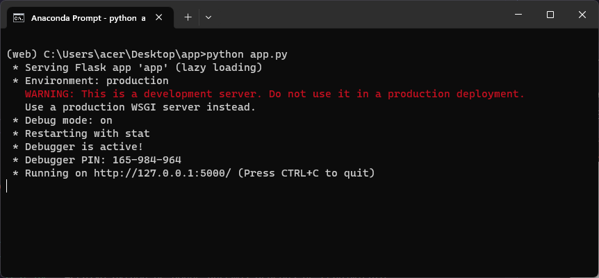
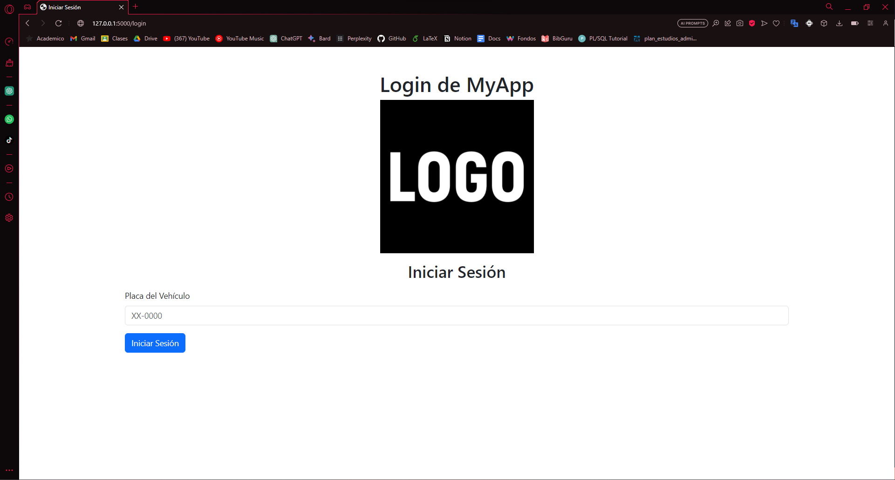

# Mi Aplicación Web con Flask y Bootstrap

Esta es una aplicación web desarrollada con Flask y Jinja, y utiliza el framework Bootstrap para el diseño y estilo.

## Requisitos Previos

- Python 3.7 o superior
- Anaconda (opcional pero recomendado)

## Configuración del Entorno

1. Clona este repositorio en tu máquina local:

   ```bash
   git clone https://github.com/tuusuario/mi-aplicacion-web.git
   ```

2. Crea y activa un entorno virtual de Anaconda llamado "web":

   ```bash
   conda create -n web python=3.8
   conda activate web
   ```

3. Instala las dependencias necesarias:

   ```bash
   pip install flask
   ```

## Ejecutar la Aplicación

1. Asegúrate de estar en el entorno virtual "web".

2. Navega a la carpeta raíz de la aplicación:

   ```bash
   cd mi-aplicacion-web
   ```

3. Ejecuta la aplicación:

   ```bash
   python app.py
   ```

4. Deberia mostrar una salida asi en la terminal:

    5. Abre tu navegador y ve a `http://localhost:5000` para ver la aplicación en acción.
   En caso se ejecute con normalidad, deberia direccionarte al login de la App.



## Estructura del Proyecto

- `app.py`: Archivo principal de la aplicación Flask.
- `load_data.py`: Archivo python de donde extraeremos datos para la aplicación Web.
- `test.py`: Archivo python de donde ahremos pruebas de rendimiento.
- `templates/`: Carpeta que contiene las plantillas HTML utilizando Jinja.
- `pdf/`: Carpeta que contiene todos los PDFs y placas que cargaremos con `load_data.py`.

## Contribuciones

Las contribuciones son bienvenidas. Si encuentras errores o mejoras, siéntete libre de crear un issue o enviar un pull request.
